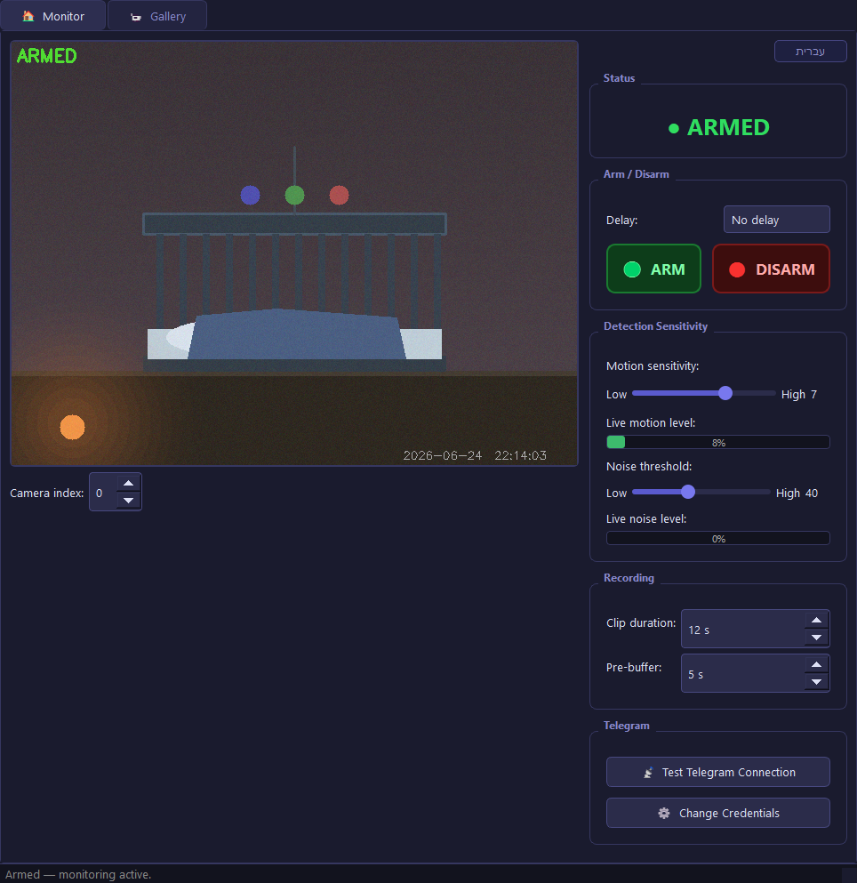

# 🏠 HomeGuard — Baby & Children Room Monitor

**HomeGuard** is a Windows desktop application that turns any webcam and microphone into a smart baby/children room monitor.  
When motion or noise is detected while the system is armed, it records a video clip and sends it to your phone via Telegram — automatically.



---

## ✨ Features

| Feature | Details |
|---|---|
| 👁️ **Motion detection** | OpenCV frame-differencing with adjustable sensitivity (1–10) |
| 🔊 **Noise detection** | Microphone RMS monitoring with adjustable threshold |
| ⏱️ **Arm countdown** | Configurable delay (0 s / 30 s / 1 min / 2 min / 5 min) before arming |
| 📹 **Pre-event buffer** | Captures footage *before* the alert and prepends it to the clip (configurable, default 5 s) |
| 🔁 **Continuous recording** | If motion persists, keeps recording in configurable-length chunks until the subject leaves the frame |
| 📲 **Telegram alerts** | Sends a message + video clip to your phone |
| 🗂️ **Gallery** | Built-in gallery tab to browse and replay all saved recordings |
| 🌐 **Hebrew / English UI** | Switch languages at any time with the toggle button — layout direction adjusts automatically |
| 🌑 **Dark theme** | Fully styled dark UI — easy on the eyes at night |
| 📦 **Standalone EXE** | Single `HomeGuard.exe` — no Python or libraries needed on the target machine |

---

## 📸 Screenshots

### Main Monitor Tab


---

## 🚀 Getting Started

### Option A — Run the pre-built EXE (recommended)

1. Download `HomeGuard.exe` from the [Releases](../../releases) page.
2. Place it in any folder (e.g. `C:\HomeGuard\`).
3. Double-click to launch — on first run, a setup dialog will ask for your Telegram credentials.
4. Recordings will be saved in a `recordings\` folder next to the EXE.

### Option B — Build from source

```bash
# 1. Clone the repo
git clone https://github.com/BotAmbush/HomeGuard.git
cd HomeGuard

# 2. Install dependencies
pip install -r requirements.txt

# 3. Run in Python (development mode)
python main.py

# 4. Build standalone EXE
python build.py
```

> **Requires Python 3.11+** and a working webcam / microphone.

---

## 📲 Telegram Setup

1. Open Telegram → search **@BotFather** → `/newbot`
2. Copy the **Bot Token** you receive.
3. Send any message to your new bot.
4. Visit `https://api.telegram.org/bot<TOKEN>/getUpdates` and copy the `"id"` value from the `"chat"` field.
5. On first launch, HomeGuard shows a setup dialog — paste your token and chat ID there.

Credentials are stored in `telegram.txt` next to the EXE (plain text, easy to edit).

---

## 🔔 How Alerts Work

```
Motion / Noise detected
        │
        ▼
┌───────────────────────────────────────────┐
│  First clip                               │
│  • Pre-buffer (default 5 s, configurable) │
│  • Live recording (default 15 s)          │
│  • Telegram message + video               │
└───────────────────┬───────────────────────┘
                    │ motion still active?
                    ▼
          ┌─────────────────────┐
          │  Next chunk (15 s)  │──► repeat until still
          └─────────────────────┘
```

---

## 🛠️ Project Structure

```
HomeGuard/
├── main.py           # PyQt5 UI, state machine, alert logic
├── monitor.py        # CameraThread, AudioMonitor, RecordingThread
├── telegram_bot.py   # TelegramSender (QThread)
├── gallery.py        # Gallery tab with thumbnail grid + video player
├── config.py         # Config load/save, path helpers
├── i18n.py           # Hebrew / English translations
├── build.py          # PyInstaller build script → HomeGuard.exe
├── requirements.txt
└── screenshots/
    └── preview.png
```

---

## ⚙️ Configuration

Settings are saved automatically in `config.json` next to the EXE:

| Key | Default | Description |
|---|---|---|
| `motion_sensitivity` | 5 | 1 (low) – 10 (high) |
| `noise_threshold` | 30 | Microphone RMS threshold (1–100) |
| `countdown_delay` | 30 | Arm delay in seconds |
| `clip_duration` | 15 | Recording chunk duration in seconds |
| `pre_buffer_secs` | 5 | Pre-event buffer length in seconds (0–30) |
| `camera_index` | 0 | Camera device index |
| `language` | `"en"` | UI language — `"en"` or `"he"` |

---

## 📦 Dependencies

| Package | Purpose |
|---|---|
| `PyQt5` | GUI framework |
| `opencv-python` | Webcam capture, motion detection |
| `sounddevice` / `soundfile` | Microphone capture & WAV write |
| `imageio-ffmpeg` | Bundled ffmpeg for video+audio merge |
| `requests` | Telegram Bot API calls |
| `certifi` | SSL certificates inside frozen EXE |
| `numpy` / `Pillow` | Image/audio processing |

---

## 📄 License

MIT — free to use, modify, and distribute.
